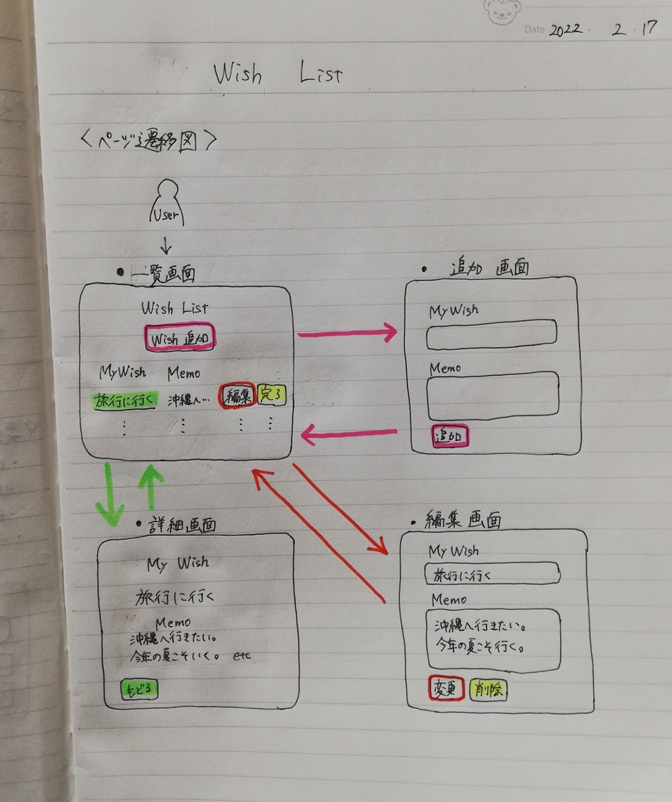

# 概要

まみこチャレンジのファーストステッププロジェクトです。
このプロジェクトでは、Webシステムの基礎を学習します。

このプロジェクトの目指すゴールは下記のとおりです。

## 着手前の状態

- 下記サービスを独学している
    - Progate
    - ドットインストール
- 前述のサービスで下記言語のコンテンツを一通り視聴済み
    - HTML
    - CSS
    - JavaScript
    - PHP
    - MySQL
- 動画を見ずにコンテンツを実装した経験なし
- 動画の内容の理解度は自己評価で30%程度

## ゴール

- 自身で考案の「WishList」の実装完了
- PHPの基礎を理解
- データベースの基礎を理解

### 補足：PHPの基礎

PHPの基礎には下記を含めています。

- 変数
- 分岐
- 繰り返し
- データの保存と参照
- PHPとHTMLの連携

### 補足：データベースの基礎

データベースの基礎には下記を含めています。

- データベース作成
- テーブル作成
- データの作成、参照、更新、削除

# 要件定義

今回実装するシステムは Wish List です。
必要要件などは下記のとおりです。

## 必要な機能

- Wish追加（新規作成）
- Wish一覧
- Wish詳細
- Wish編集
- Wish完了（削除）

## 必要な画面

- 一覧画面
- 追加画面
- 編集画面
- 詳細画面

## 画面遷移

